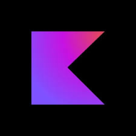

### Hi there 👋

I'm just developer.

How to reach me: [Twitter](https://twitter.com/captanbravo), [Linkedin](https://www.linkedin.com/in/barisatalay07)

The code, projects and algorithms you will see here are proof of how confused I am.

#### 🧰 Languages and Tools:

