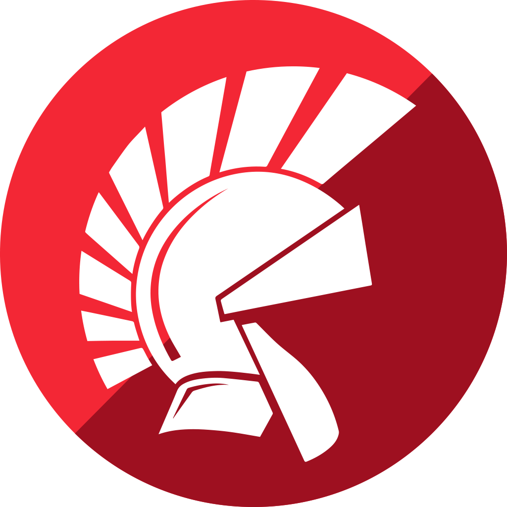

### Hi there 👋

<!--
**barisatalay/barisatalay** is a ✨ _special_ ✨ repository because its `README.md` (this file) appears on your GitHub profile.

Here are some ideas to get you started:

- 🔭 I’m currently working on Teknasyon / Getcontact
- 🌱 I’m currently learning ...
- 👯 I’m looking to collaborate on ...
- 🤔 I’m looking for help with ...
- 💬 Ask me about ...
- 📫 How to reach me:
- 😄 Pronouns: ...
- ⚡ Fun fact: ...

 ;) I'm currently working in [Getcontact](https://www.getcontact.com/) at [Teknasyon](https://engineering.teknasyon.com/)
-->

I'm just developer.

How to reach me: [Twitter](https://twitter.com/captanbravo), [Linkedin](https://www.linkedin.com/in/barisatalay07)

The code, projects and algorithms you will see here are proof of how confused I am.

#### 🧰 Languages and Tools:

